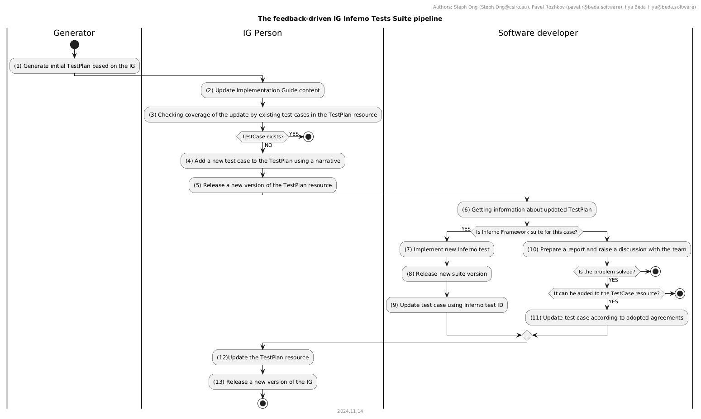

# AU Inferno Test Coverage
A repository containing text, code, and resources focused on addressing the challenge of achieving IG coverage through Inferno tests.

## Notes:

At the current step, we have several implemented inferno test types:

- Basic search
- Search using combo parameters
- Search by specific identifier
- Search with _include
- Search with _revinclude
- Read
- Validation of the target resource
- Checking elements of the target resource (Must Support)
- Checking references of the target resource (Must Support)

What tests are not implemented, but look like they should:

- Create
- Update
- Delete
- ... something can be missed because it exists in the narrative of the IG, but does not exist as a machine-readable part.

These implemented tests send requests to the target FHIR server every run, which means that we can collect and analyze them in reports:
- Basic search
- Search using combo parameters
- Search by specific identifier
- Search with _include
- Search with _revinclude
- Read

## References
### Documentation
- https://build.fhir.org/testing.html
- https://build.fhir.org/testscript.html
- https://build.fhir.org/testplan.html
- https://build.fhir.org/testreport.html

### Discussions
#### TestPlan
- [2022-07-29 04:37 Placeholder to propose changes to TestScript resource and TestReport resource](https://jira.hl7.org/browse/FHIR-37824)
- [2023-03-21 TestPlan needs to be a canonical resource](https://jira.hl7.org/browse/FHIR-40667)
- [2023-05-07 Typos in TestPlan](https://jira.hl7.org/browse/FHIR-41227)
- [2023-05-07 Reference and CodeableReference with empty targets](https://jira.hl7.org/browse/FHIR-41228)
- [2023-05-08 Remove TestReport resource type for FHIR R6](https://jira.hl7.org/browse/FHIR-41237)
- [2023-09-10 Add reference to Requirement.statement.key](https://jira.hl7.org/browse/FHIR-42720)
- [2023-09-11 TestPlan.testCase need "id", and "description"](https://jira.hl7.org/browse/FHIR-42725)
- [2024-06-22 TestPlan.testCase.testRun.script.source[x] should be markdown](https://jira.hl7.org/browse/FHIR-46207)
- [2024-08-13 Add a new hierarchy for TestPlan called TestScenario ](https://jira.hl7.org/browse/FHIR-46628)
- [2024-09-06 Adding a visual diagram ](https://jira.hl7.org/browse/FHIR-47127)
- [2024-09-06 Performance testing support](https://jira.hl7.org/browse/FHIR-47131)
- [2024-09-06 Test automation support](https://jira.hl7.org/browse/FHIR-47132)
- [2024-09-13 Need a functional TestReport](https://jira.hl7.org/browse/FHIR-47614)
#### TestScript
#### TestReport
