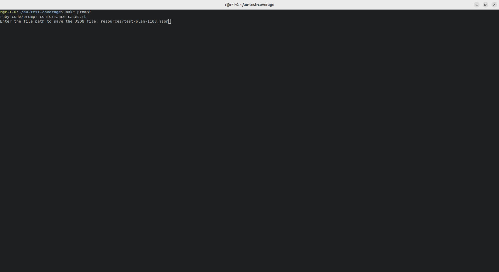
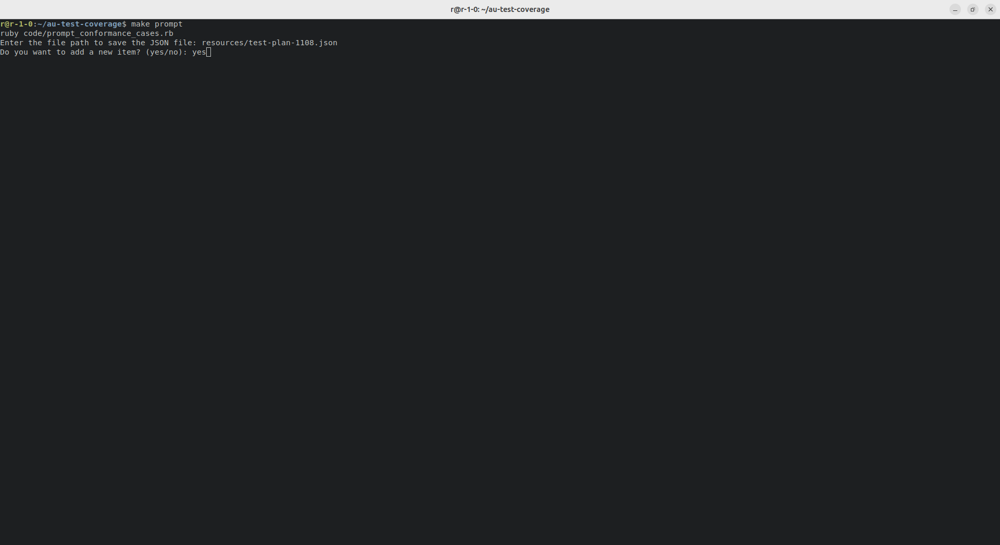
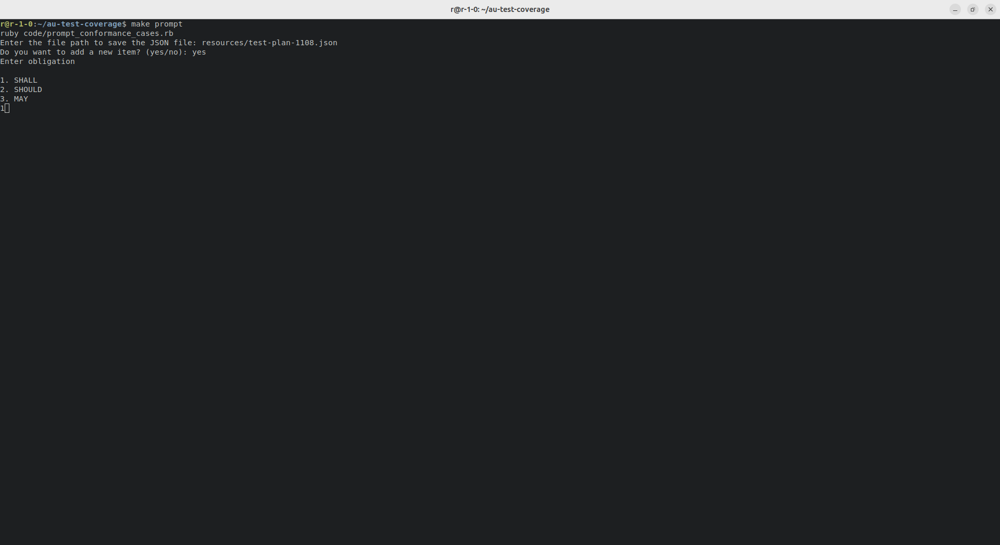
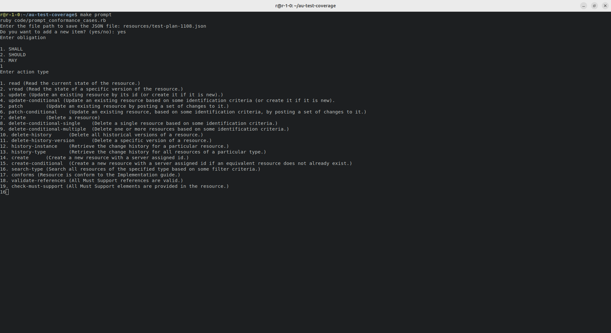
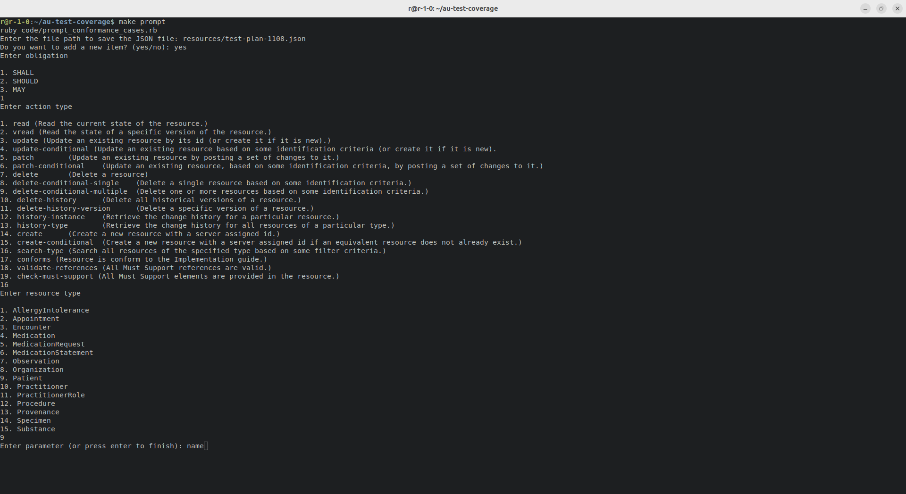
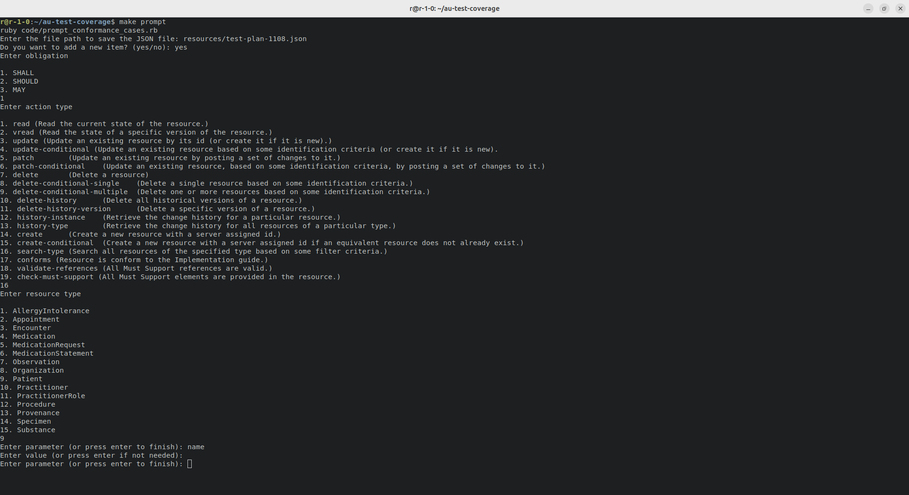
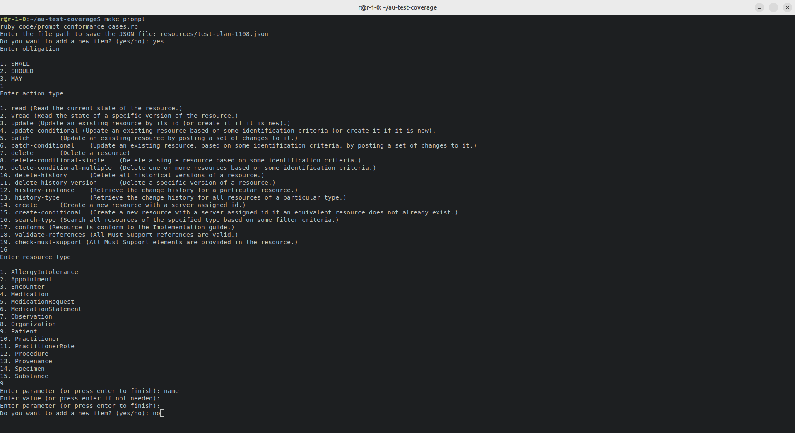
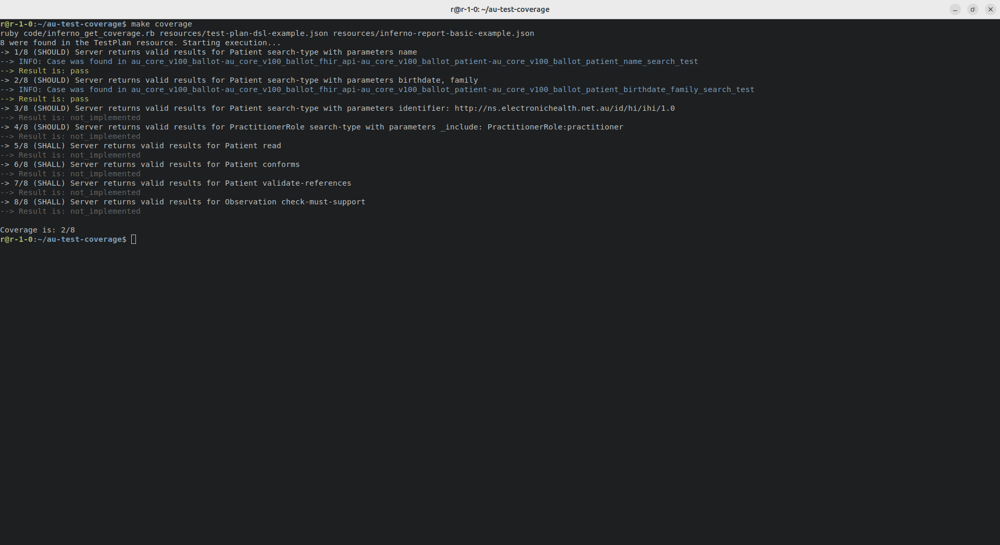

# Implementation of the tool for AU Core IG coverage report by Inferno tests
## Problem
Implement a way to get the coverage of the Implementation Guide by Inferno tests.
## Initial data

At the current step, we have several implemented inferno test types:

- Basic search
- Search using combo parameters
- Search by specific identifier
- Search with _include
- Search with _revinclude
- Read
- Validation of the target resource
- Checking elements of the target resource (Must Support)
- Checking references of the target resource (Must Support)

What tests are not implemented, but look like they should:

- Create
- Update
- Delete
- ... something can be missed because it exists in the narrative of the IG, but does not exist as a machine-readable part.

These implemented tests send requests to the target FHIR server every run, which means that we can collect and analyze them in reports:
- Basic search
- Search using combo parameters
- Search by specific identifier
- Search with _include
- Search with _revinclude
- Read

The Inferno report consists of a JSON file that includes a list of all test runs of the session.

<details>
<summary>
Inferno report example
</summary>

```json
[
    {
        "id": "53e860fe-2692-4c7c-bf7b-d23632818c56",
        "created_at": "2024-11-04T10:20:19.982+00:00",
        "inputs": [
            {
                "name": "url",
                "value": "https://au-core.beda.software/fhir",
                "type": "text"
            },
            {
                "name": "smart_credentials",
                "value": "{}",
                "type": "oauth_credentials"
            },
            {
                "name": "header_name",
                "value": null,
                "type": "text"
            },
            {
                "name": "header_value",
                "value": null,
                "type": "text"
            }
        ],
        "optional": false,
        "outputs": [],
        "requests": [
            {
                "id": "6bd5c0a3-335f-4ea3-bd28-b871398631c7",
                "direction": "outgoing",
                "index": 314680,
                "result_id": "53e860fe-2692-4c7c-bf7b-d23632818c56",
                "status": 200,
                "timestamp": "2024-11-04T10:20:19.988+00:00",
                "url": "https://au-core.beda.software/fhir/Practitioner/practitioner-tc",
                "verb": "get"
            }
        ],
        "result": "pass",
        "test_id": "au_core_v100_ballot-au_core_v100_ballot_fhir_api-au_core_v100_ballot_practitioner_role-au_core_v100_ballot_practitioner_role_reference_resolution_test",
        "test_run_id": "bfb1bd25-a274-42a1-a5f4-eaf179603ee7",
        "test_session_id": "fT4xd0lfJWC",
        "updated_at": "2024-11-04T10:20:19.982+00:00"
    }
]
```

</details>

According to the FHIR specification, the `TestPlan` resource can be used to describe the purpose, dependencies, scope, test environment, test framework, test output, etc. It contains test cases that can outline narrative test entry/exit criteria, test data, and more.
([Reference to the specification](http://hl7.org/fhir/testplan.html))

To keep the test reports in FHIR format, we can use the `TestReport` resource. This resource defines how systems should encode the summarized results of executing a `TestScript`.
([Reference to the specification](http://hl7.org/fhir/testreport.html))

The IG test coverage pipeline could work as follows:

1. `TestPlan` resources are created and distributed as part of the AU Core Implementation Guide.
2. The implementer runs the Inferno suite and generates a default Inferno report in JSON format.
3. The implementer runs a specific script that analyzes the Inferno report using `TestPlan` resources to identify coverage.
4. As a result, the implementer receives a `TestReport` resource that includes coverage details about which tests were passed, failed, or skipped. Additionally, the `TestReport` provides supporting information about messages sent to Inferno, requests made, etc.

Challenges in this pipeline:

1. There is no way to describe the details of a test case in the `TestPlan` resource without using `TestScript` or other tools; only high-level narratives are available. This makes it difficult to compare a high-level test case description with a test in the Inferno report. While it’s theoretically possible to implement this using LLMs, their results are often unstable and unpredictable.
2. There is a heavy dependency on the `TestScript` resource.

## Proposal
We suggest using the TestPlan FHIR resource with a combination of a Domain-Specific Language (DSL) designed to describe and track the coverage of test scenarios in the Inferno testing framework, focusing on FHIR compliance. By using a custom DSL, we aim to simplify the reporting, readability, and extensibility of test coverage, ensuring that each scenario is clearly defined, easily parsed, and consistent with FHIR implementation requirements.

The DSL captures critical aspects of each test scenario—such as action type, resource type, and parameters—allowing testers and developers to define and document coverage requirements in a concise, accessible way. This proposal details the DSL syntax, provides examples with explanations, and evaluates the pros and cons of the current approach.

### DSL Format

Each test case in the DSL is represented as an array. The structure of each entry is as follows:

```
['REQUIREMENT', 'ACTION', 'RESOURCE_TYPE', PARAMETERS]
```

- **REQUIREMENT**: Specifies whether the test is mandatory (`SHALL`) or recommended (`SHOULD`).
- **ACTION**: Indicates the type of action to be validated, such as `SEARCH`, `READ`, `CONFORMS`, `VALIDATE_REFERENCES`, or `CHECK_MUST_SUPPORT`.
- **RESOURCE_TYPE**: Defines the FHIR resource type being tested, like `Patient`, `PractitionerRole`, or `Observation`.
- **PARAMETERS**: Lists search parameters, reference elements, or other specifics, in an array structure to accommodate complex scenarios.

### Examples with Descriptions

Below are sample test cases in the DSL format with explanations.

#### Example 1: Patient Search by Name

**DSL Representation**:
```plaintext
['SHOULD', 'SEARCH', 'Patient', [['name']]]
```

#### Example 2: Patient Search by Birthdate + Family Name

**DSL Representation**:
```plaintext
['SHOULD', 'SEARCH', 'Patient', [['birthdate'], ['family']]]
```

#### Example 3: Patient Search by Identifier (IHI)

**DSL Representation**:
```plaintext
['SHOULD', 'SEARCH', 'Patient', [['identifier', 'http://ns.electronichealth.net.au/id/hi/ihi/1.0']]]
```

#### Example 4: Practitioner Role with _include

**DSL Representation**:
```plaintext
['SHOULD', 'SEARCH', 'PractitionerRole', [['_include', 'PractitionerRole:practitioner']]]
```

#### Example 5: Patient Resource Conformance

**DSL Representation**:
```plaintext
['SHALL', 'CONFORMS', 'Patient']
```

#### Example 6: Must Support References

**DSL Representation**:
```plaintext
['SHALL', 'CHECK_MUST_SUPPORT', 'Observation']
```

### Pros and Cons

#### Pros

1. **Simplicity and Clarity**: The DSL is straightforward, making it easy for both humans and machines to parse. It separates critical test components into structured, predictable entries.
2. **Concise Format**: Each test is compactly represented, making it easy to read, store, and scan large sets of test cases quickly.
3. **Flexibility with Parameters**: The array structure allows for flexible and complex parameter configurations, which is essential for FHIR search functionality.
4. **Extensibility**: The DSL’s design makes it adaptable; new action types or test requirements can be added without disrupting existing tests.

### Example of the TestPlan resource with DSL
<details>
<summary>Example</summary>

```json
{
  "resourceType": "TestPlan",
  "id": "example",
  "extension": [
    {
      "url": "http://hl7.org/fhir/StructureDefinition/structuredefinition-wg",
      "valueCode": "fhir"
    }
  ],
  "status": "draft",
  "publisher": "HL7 International / FHIR Infrastructure",
  "testCase": [
    {
      "testRun": [
        {
          "narrative": "(SHOULD) Server returns valid results for Patient search-type with parameters name",
          "script": {
            "sourceString": "[\"SHOULD\",\"search-type\",\"Patient\",[[\"name\"]]]"
          }
        }
      ]
    },
    {
      "testRun": [
        {
          "narrative": "(SHOULD) Server returns valid results for Patient search-type with parameters birthdate, family",
          "script": {
            "sourceString": "[\"SHOULD\",\"search-type\",\"Patient\",[[\"birthdate\"],[\"family\"]]]"
          }
        }
      ]
    },
    {
      "testRun": [
        {
          "narrative": "(SHOULD) Server returns valid results for Patient search-type with parameters identifier: http://ns.electronichealth.net.au/id/hi/ihi/1.0",
          "script": {
            "sourceString": "[\"SHOULD\",\"search-type\",\"Patient\",[[\"identifier\",\"http://ns.electronichealth.net.au/id/hi/ihi/1.0\"]]]"
          }
        }
      ]
    },
    {
      "testRun": [
        {
          "narrative": "(SHOULD) Server returns valid results for PractitionerRole search-type with parameters _include: PractitionerRole:practitioner",
          "script": {
            "sourceString": "[\"SHOULD\",\"search-type\",\"PractitionerRole\",[[\"_include\",\"PractitionerRole:practitioner\"]]]"
          }
        }
      ]
    },
    {
      "testRun": [
        {
          "narrative": "(SHALL) Server returns valid results for Patient read",
          "script": {
            "sourceString": "[\"SHALL\",\"read\",\"Patient\",[]]"
          }
        }
      ]
    },
    {
      "testRun": [
        {
          "narrative": "(SHALL) Server returns valid results for Patient conforms",
          "script": {
            "sourceString": "[\"SHALL\",\"conforms\",\"Patient\",[]]"
          }
        }
      ]
    },
    {
      "testRun": [
        {
          "narrative": "(SHALL) Server returns valid results for Patient validate-references",
          "script": {
            "sourceString": "[\"SHALL\",\"validate-references\",\"Patient\",[]]"
          }
        }
      ]
    },
    {
      "testRun": [
        {
          "narrative": "(SHALL) Server returns valid results for Observation check-must-support",
          "script": {
            "sourceString": "[\"SHALL\",\"check-must-support\",\"Observation\",[]]"
          }
        }
      ]
    }
  ],
  "contact": [
    {
      "telecom": [
        {
          "system": "url",
          "value": "http://www.hl7.org/Special/committees/fiwg"
        }
      ]
    }
  ]
}
```

</details>

### How to create a TestPlan resource

In the first step, this resource with the set of test cases described by DSL can be generated through an automatic generator based on the data from the Implementation Guide content as it is implemented for the AU Core Inferno suite. 

The next updates of this file can be provided by IG implementers handly. For this feature, we can implement a simple CLI with a prompt interface to create/update/delete cases. In the case of the implementation of the CLI, the DSL can be hidden from implementers at all. See the example of the ruby script here. 

### Coverage report

We suggested using a TestReport FHIR resource. It can be generated by a specific script that can work with the TestPlan resource and report of the Inferno framework. This script shall work with DSL and check the data in the inferno's report according to the requirements in the DSL expression.

<details>
<summary>Example of the TestReport</summary>

```json
{
  "resourceType": "TestReport",
  "name": "Inferno Test Report",
  "status": "completed",
  "testScript": "TestScript/au_core_v100_ballot",
  "result": "pass",
  "score": 0,
  "tester": "Inferno",
  "test": [
    {
      "name": "92f92d56-9bdf-4d67-a7a0-e3174299ecdf",
      "description": "(SHOULD) Server returns valid results for Patient search-type with parameters name",
      "action": [
        {
          "assert": {
            "detail": "run",
            "result": "pass"
          }
        },
        {
          "operation": {
            "result": "pass",
            "detail": "https://au-core.beda.software/fhir/Patient?_count=10&name=Wang"
          }
        }
      ]
    },
    {
      "name": "ffbe7486-a6ce-4792-9680-4b9179464370",
      "description": "(SHOULD) Server returns valid results for Patient search-type with parameters birthdate, family",
      "action": [
        {
          "assert": {
            "detail": "run",
            "result": "pass"
          }
        },
        {
          "operation": {
            "result": "pass",
            "detail": "https://au-core.beda.software/fhir/Patient?_count=10&birthdate=1975-05-03&family=Wang"
          }
        }
      ]
    }
  ]
}
```
</details>

## Conclusion

The proposed solution for implementing an AU Core IG coverage report leverages the flexibility of a custom Domain-Specific Language (DSL) and the FHIR `TestPlan` and `TestReport` resources to document and assess the breadth of coverage provided by Inferno tests. The DSL captures test scenarios with clear requirements and actions, making it easier to define, understand, and track IG compliance.

The `TestPlan` resource offers a structured way to outline test cases, while the `TestReport` resource enables detailed documentation of test outcomes, facilitating a transparent and systematic approach to IG testing. By automating the comparison between test outcomes and requirements, this solution provides a streamlined method for implementers to assess compliance with AU Core IG requirements, helping to ensure reliable, standards-based FHIR implementations.

Future work may include enhancing tooling, such as a CLI, to simplify DSL creation and maintenance, making the process even more accessible to IG implementers. With this framework in place, FHIR developers and implementers can more efficiently verify and document the conformance of FHIR implementations to specified IG requirements.

## Examples










